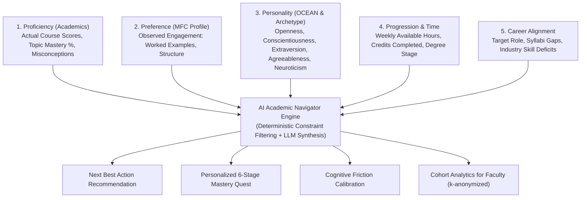
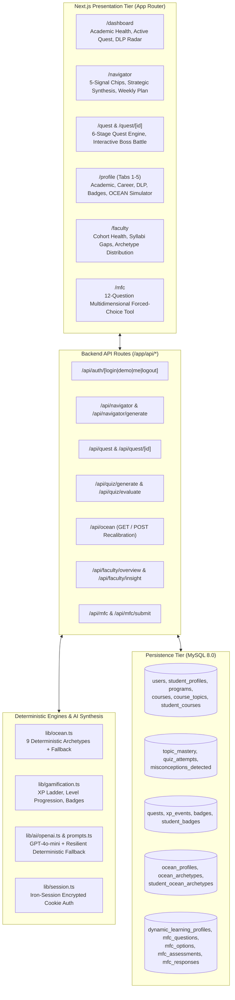

# LearnQuest AI — Full System Architecture & Technical Specification

> **Version:** 2.0.0-PROD  
> **Repository:** `d:/EdTech`  
> **Stack:** Next.js 14 (App Router) + TypeScript + Tailwind CSS + MySQL 8.0 (XAMPP) + OpenAI GPT-4o-mini  
> **Status:** All 45 Sections Implemented, Tested, & Verified (`npm run build` cleanly passed)

---

## 1. Executive Summary & Core Philosophy

**LearnQuest AI** is an institutional-grade adaptive learning platform and academic navigation engine designed for higher education. Most EdTech tools suffer from one of three fatal flaws:
1. **Pigeonholing / Stereotyping:** Trapping students into debunked, rigid "learning styles" (e.g., claiming a student is solely a "visual learner").
2. **Disconnected Gamification:** Superficial streaks and badges that have zero alignment with university degree progression, actual syllabus gaps, or job market readiness.
3. **Black-Box AI Recommendations:** Generative AI suggestions that hallucinate remedies without auditing prerequisite chains, cognitive load, or personality trait tolerances.

LearnQuest AI eliminates these failures through a **deterministic 5-signal synthesis model**:



### The Pedagogical Wall (Strict Product Rules)
* **Personality (OCEAN):** Explains *behavioral tendencies and environmental friction tolerances*. It is **never** a diagnosis, academic ability predictor, or career restriction.
* **Preference (Dynamic Learning Profile / MFC):** Measures *how a student engages right now* (e.g. Worked Examples: 82%, Practice-First: 45%).
* **Proficiency (Academics):** Governs *what the student actually knows* (e.g. DBMS: 62%, Normalization: 52%). **Academic gaps always take absolute precedence.**
* **Behavior (Telemetry):** Dynamic quiz telemetry and error rates constantly update mastery and recalibrate preferences.

---

## 2. High-Level Technical Architecture



---

## 3. Database Architecture (26 Relational Tables)

The database schema is defined in `database/schema.sql` and fully seeded in `database/learnquest_full.sql`.

### Relational Entity Groups

1. **Authentication & Core Academics:**
   * `users`: User identity, hashed passwords, role (`student`, `faculty`, `admin`).
   * `departments`: Academic departments (e.g. Computer Science, Information Science).
   * `programs`: Degree programs (e.g. B.Tech Computer Science & Engineering).
   * `courses`: Catalog courses with credits, semester, syllabus outline.
   * `course_topics`: Granular sub-topics mapped to parent courses (e.g. Functional Dependencies).
   * `student_profiles`: Demographics, CGPA, target career goal, weekly available hours, academic health score.
   * `student_courses`: Enrollment records with continuous evaluation scores and letter grades.

2. **Knowledge Tracing & Diagnostic Assessment:**
   * `topic_mastery`: Real-time topic mastery score (0–100%), attempt counters, last assessed timestamps.
   * `quiz_attempts`: Telemetry log capturing questions, options, student selections, correctness, and detected conceptual misconceptions.

3. **Gamification & Mastery Quests:**
   * `quests`: Multi-stage learning journeys (6 stages: Review, Scaffolding, Practice, Challenge, Transfer, Boss Battle).
   * `xp_events`: Immutable audit ledger of XP grants (quiz answers, quest completions, streaks).
   * `badges`: Achievement definitions with unlock rules.
   * `student_badges`: Unlocked badges per student.

4. **Preference Diagnostics (MFC):**
   * `mfc_dimensions`: 6 cognitive/engagement dimensions.
   * `mfc_questions`: Scenario-based trade-off questions forcing authentic prioritization.
   * `mfc_options`: Weighted behavioral options mapped to dimensions.
   * `mfc_assessments`: Assessment completion logs.
   * `mfc_responses`: Raw student selections.
   * `dynamic_learning_profiles`: Live 8-dimensional scores (Worked Examples, Guided Learning, Reflection, etc.).

5. **Personality & Archetypes (OCEAN):**
   * `ocean_profiles`: Raw Big Five trait scores (0–100) and computed trait bands (`low`, `moderate`, `high`).
   * `ocean_archetypes`: Catalog of 9 research-backed university student archetypes.
   * `student_ocean_archetypes`: Primary & secondary student archetype classifications with confidence scores and reasoning evidence.

---

## 4. Deterministic OCEAN Personality Classification Engine

Located in `lib/ocean.ts`, the engine processes normalized 0–100 scores across:
- **O:** Openness to Experience
- **C:** Conscientiousness
- **E:** Extraversion
- **A:** Agreeableness
- **N:** Neuroticism

### Trait Band Boundaries
* **Low:** $< 40$
* **Moderate:** $40 \le score \le 65$
* **High:** $> 65$

### The 9 University Archetypes & Matching Rules

| Archetype Key | Archetype Name | Trait Criteria | Pedagogical Strategy |
| :--- | :--- | :--- | :--- |
| `creative_builder` | Creative Builder | High Openness + High Conscientiousness | Hands-on project milestones, architectural design, autonomous prototyping |
| `connector` | Connector | High Extraversion + High Agreeableness | Collaborative review, peer discussions, study group co-anchoring |
| `challenger` | Challenger | High Openness + Low Agreeableness | Critical code reviews, boundary tests, edge-case debugging, competitive benchmarks |
| `worried_achiever` | Worried Achiever | High Conscientiousness + High Neuroticism | Low-stakes quizzes, explicit grading rubrics, phased checkpoints to reduce anxiety |
| `steady_executor` | Steady Executor | High Conscientiousness + Low Neuroticism | Systematic syllabus pacing, sequential checklists, structured habit tracking |
| `idea_explorer` | Idea Explorer | High Openness + Low Conscientiousness | High-concept explorations paired with micro-sprint checkpoints and rigid deadlines |
| `sensitive_supporter`| Sensitive Supporter| High Agreeableness + High Neuroticism | Gentle scaffolded feedback, non-punitive retries, encouraging mentors |
| `growth_builder` | Growth Builder | High Openness + Low Neuroticism | Experimental stretch challenges, cutting-edge topics, self-directed research |
| `team_driver` | Team Driver | High Extraversion + High Conscientiousness | Group quest leadership, hackathon sprints, time-boxed milestones |
| `mixed_pattern` | Balanced Explorer | Balanced across trait bands | Versatile multi-modal learning blend |

---

## 5. AI Academic Navigator Multi-Signal Decision Pipeline

Located in `app/api/navigator/generate/route.ts` with fallback in `lib/ai/fallback.ts`:

1. **Academic Auditing:** Detects weakest courses (e.g., DBMS at 62%) and critical prerequisites (Normalization at 52%).
2. **Career Impact Analysis:** Correlates student target career (e.g. *Full Stack Developer*) against industry prerequisites.
3. **Time Feasibility:** Evaluates weekly learning budget (e.g., 14 hrs/week) to design a realistic schedule without burnout.
4. **Scaffolding Selection (MFC):** Matches student's high preference for Worked Examples (82%) by prescribing reverse-engineered schemas first.
5. **Friction Calibration (OCEAN):** Detects *Creative Builder* (High O, High C, Low N) and optimizes for creative, hands-on architectural problem solving.

---

## 6. Faculty Institutional Intelligence & Aggregation

Located in `app/api/faculty/overview/route.ts` and `app/faculty/page.tsx`:

* **Privacy Preservation (k-anonymity):** Faculty dashboards strictly display aggregate cohort metrics. Individual student profiles are never exposed to prevent cognitive bias or stereotyping.
* **Curriculum Syllabi Gaps:** Highlights cohorts at risk (e.g. 64% struggling with *BCNF and Functional Dependencies* in CS201).
* **Cohort Archetype Distribution:** Visualizes the breakdown across 42 students (e.g., 28% Creative Builders, 19% Steady Executors, 14% Worried Achievers) to help professors calibrate lecture delivery and team project groupings.

---

## 7. 7-Minute Judge Presentation Script

```
00:00 - 01:00 | The Problem
"Most educational software is either a boring gradebook or a cartoonish game that hands out XP for trivial clicks. Worse, older systems label students as 'visual' or 'auditory' learners—a myth that limits potential. LearnQuest AI changes this with a deterministic 5-signal navigation engine."

01:00 - 02:30 | The Student Experience (Dashboard & Profile)
"Meet Rahul Sharma. Rahul is enrolled in B.Tech Computer Science. Notice his Academic Health score is 74%, but his DBMS grade is lagging at 62%. Look at his profile: he has completed the Multidimensional Forced-Choice assessment and Big Five inventory, classifying him as a 'Creative Builder'. His preferences reveal he learns best when presented with Worked Examples first."

02:30 - 04:00 | The AI Academic Navigator
"Instead of guessing what to study, Rahul clicks 'AI Academic Navigator'. In real time, the engine synthesizes his lowest topic (Normalization at 52%), his career goal (Full Stack Developer), his 14-hour weekly budget, and his Creative Builder archetype. The result is a pinpoint recommendation: 3NF & BCNF Decomposition, framed through hands-on schema refactoring."

04:00 - 05:30 | The Adaptive Quest & Misconception Remediation
"Rahul accepts the Quest. He journeys through Review, Guided Scaffolding, and into the Boss Battle. When he makes an error, our engine doesn't just say 'Wrong'—it diagnoses the exact misconception: confusing Transitive Dependency with Partial Dependency, awarding targeted remediation and adjusting mastery."

05:30 - 06:30 | The Faculty Cohort Intelligence
"Now let's switch to Dr. Priya Mehta's view. Faculty can't spy on individual student traits—that would violate our pedagogical ethics. Instead, Dr. Priya sees cohort-wide analytics: where the curriculum is failing, and how the cohort's archetypes are distributed so she can structure project teams effectively."

06:30 - 07:00 | Conclusion & Impact
"LearnQuest AI provides clarity without stereotypes, rigor with gamification, and institution-wide intelligence. It knows where you are, knows what matters, and knows what to do next."
```
