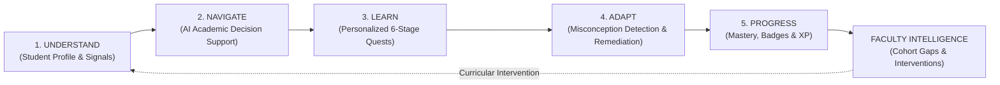
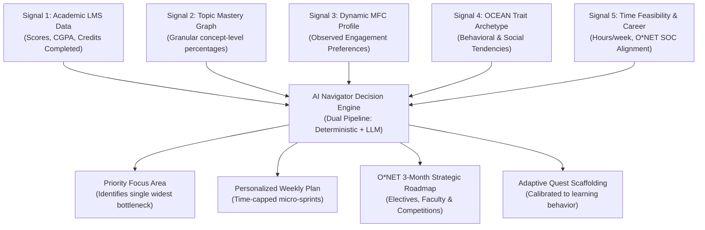
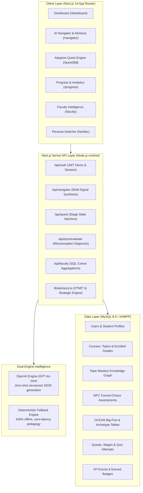

# LearnQuest AI — Executive Pitch & Architecture Briefing

> **Core Value Proposition**: *"Know where you are. Know what matters. Know what to do next."*  
> LearnQuest AI transforms fragmented university data into **multi-signal personalized academic navigation** and **adaptive gamified mastery**, connecting classroom learning directly to federal labor market readiness (O*NET).

---

## 1. End-to-End User Flow

The platform operates as a **closed-loop learning feedback flywheel** spanning both students and faculty.

### The Student Journey (Minutes 0–5)
1. **Understand (Instant Diagnostic Context)**:
   * Student logs in via 1-click role switcher (e.g., Rahul Sharma, B.Tech CSE or Ananya Rao, MBA Tech Management).
   * System synthesizes 5 live signals: **Course Performance (LMS)**, **Granular Topic Mastery**, **Observed Engagement Preferences (MFC)**, **Behavioral Tendencies (OCEAN Archetype)**, and **Weekly Study Bandwidth**.
2. **Navigate (Tactical & Strategic Decision Support)**:
   * **Tactical 7-Day Plan**: AI pinpoints the student's highest-leverage bottleneck (e.g., *Database Normalization* for CS, *Unit Economics & CAC/LTV* for MBA) and schedules micro-sprints capped within their weekly hours.
   * **3-Month Strategic Advisory**: Maps academic deficits against **O*NET labor market competencies**, next semester electives, campus faculty office hours, and university competitions.
3. **Learn & Adapt (Active Scaffolding Quest)**:
   * Student launches their active 6-stage quest (*Warm-up &rarr; Worked Example &rarr; Diagnostic Practice &rarr; Challenge &rarr; Boss Battle*).
   * **Misconception Detection**: When a student makes a mistake, the engine does *not* just mark it wrong. It identifies the precise conceptual confusion (e.g., *2NF partial vs 3NF transitive dependencies* or *Revenue LTV vs Gross Margin LTV distortion*), generates an immediate worked-example remediation, and adaptively lowers difficulty for recovery.
4. **Progress (Validated Mastery & Portfolio Cred)**:
   * Success unlocks topic mastery percentage gains, XP, and career badges (*Dependency Hunter*, *Venture Architect*).

---

## 2. Multi-Signal AI Engine: How the System Reasons

Generic ed-tech tutors rely solely on raw exam scores or prompt LLMs blindly. LearnQuest AI synthesizes **5 distinct operational signals**:

### The Pedagogical Differentiation: MFC vs VAK Myth
> **No Harmful Labeling**: Educational psychology has debunked the "VAK (Visual/Auditory/Kinesthetic) Learning Style" myth. Students do *not* have immutable learning styles.
> LearnQuest uses **Multi-Dimensional Forced-Choice (MFC)** to measure **observed engagement preferences** (e.g., *Receptivity to Worked Examples: 78%*, *Collaboration: 88%*). The profile continuously evolves as the student interacts with quizzes.

### OCEAN Behavioral Archetypes
OCEAN Big-Five scores are translated into non-judgmental behavioral archetypes:
* **Creative Builder** (High Openness + Conscientiousness): Thrives on tangible project deliverables, autonomous architecture, and concrete milestones.
* **Team Driver** (High Extraversion + Conscientiousness): Thrives on collaborative case teardowns, cross-functional sprints, and executive pitch simulations.

---

## 3. Full System Architecture

---

## 4. Multi-Stream Demonstration Matrix

LearnQuest AI is **discipline-aware**—it eliminates domain conflation by tailoring all framing, labor market codes, and pedagogical scaffolds to the student's exact degree:

| Signal Dimension | Demo Persona 1: Rahul Sharma | Demo Persona 2: Ananya Rao |
| :--- | :--- | :--- |
| **Academic Stream** | **B.Tech &middot; Computer Science & Engineering** (Year 2) | **MBA &middot; Technology Management** (Year 2) |
| **Identified Deficit** | *Database Systems (CS201)* &mdash; 62% (B-) | *Strategic Product Management (MB201)* &mdash; 64% (B-) |
| **Granular Gap Topic** | Relational Normalization (1NF, 2NF, 3NF, BCNF) at 52% | SaaS Unit Economics & LTV/CAC Modeling at 48% |
| **Career Goal** | **Full Stack / Software Engineer** | **Technical Product Manager** |
| **O*NET Code & Market** | `15-1252.00` (*Software Developers*, +25% growth, $127K median) | `15-1299.09` (*IT Product Managers*, +18% growth, $142K median) |
| **Derived Archetype** | **Creative Builder** (Openness: 84, Conscientiousness: 78) | **Team Driver** (Extraversion: 84, Conscientiousness: 78) |
| **Targeted Quest** | Quest 1: *"Defeat Normalization"* (Lossless decomposition) | Quest 3: *"Master Unit Economics & LTV/CAC"* (Cohort retention) |
| **Misconception Diagnosis** | Partial vs. Transitive Dependency confusion | Topline Revenue LTV vs. Gross Margin LTV distortion |
| **Campus Resource** | Dr. Priya Mehta (DBMS Lead Cabin CS-304) | Prof. Vikram Malhotra (Product Mgmt Chair Cabin MGMT-204) |

---

## 5. Faculty & Institutional Value Proposition

For university leadership and professors, LearnQuest AI eliminates "silent dropouts" and end-of-semester exam surprises:

1. **Real-Time Topic Gap Heatmap**: Faculty see aggregate cohort mastery without waiting for midterms (e.g., *Dr. Priya Mehta instantly sees 8 students failing 3NF transitive dependencies in CS201*).
2. **Pedagogical Intervention Recommendations**: Generates tailored classroom interventions (e.g., *"Deploy 20-minute whiteboard schema decomposition clinic before Friday's lab"*).
3. **Accreditation & Competency Tracking**: Automated audit trails linking course syllabi directly to federal labor market benchmarks (O*NET).
